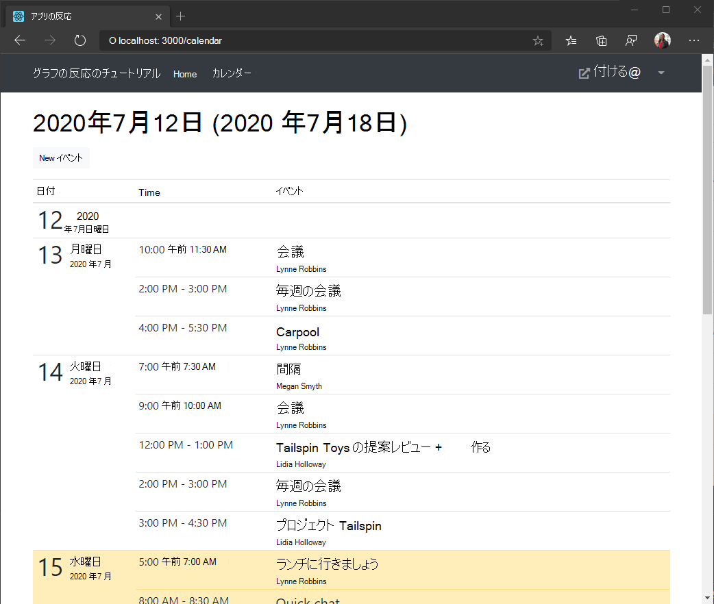

<!-- markdownlint-disable MD002 MD041 -->

この演習では、Microsoft Graph をアプリケーションに組み込みます。 このアプリケーションでは、microsoft graph[クライアント](https://github.com/microsoftgraph/msgraph-sdk-javascript)ライブラリを使用して microsoft graph への呼び出しを行います。

## <a name="get-calendar-events-from-outlook"></a>Outlook から予定表のイベントを取得する

最初に、新しいメソッドを`./src/GraphService.js`ファイルに追加して、予定表からイベントを取得します。 次の関数を追加します。

```js
export async function getEvents(accessToken) {
  const client = getAuthenticatedClient(accessToken);

  const events = await client
    .api('/me/events')
    .select('subject,organizer,start,end')
    .orderby('createdDateTime DESC')
    .get();

  return events;
}
```

このコードの内容を検討してください。

- 呼び出し先の URL は`/me/events`になります。
- この`select`メソッドは、各イベントに対して返されるフィールドを、ビューが実際に使用するものだけに制限します。
- メソッド`orderby`は、生成された日付と時刻で結果を並べ替えます。最新のアイテムが最初に表示されます。

次に、応答コンポーネントを作成して、呼び出しの結果を表示します。 という名前`./src` `Calendar.js`のディレクトリに新しいファイルを作成し、次のコードを追加します。

```JSX
import React from 'react';
import { Table } from 'reactstrap';
import moment from 'moment';
import config from './Config';
import { getEvents } from './GraphService';

// Helper function to format Graph date/time
function formatDateTime(dateTime) {
  return moment.utc(dateTime).local().format('M/D/YY h:mm A');
}

export default class Calendar extends React.Component {
  constructor(props) {
    super(props);

    this.state = {
      events: []
    };
  }

  async componentDidMount() {
    try {
      // Get the user's access token
      var accessToken = await window.msal.acquireTokenSilent(config.scopes);
      // Get the user's events
      var events = await getEvents(accessToken);
      // Update the array of events in state
      this.setState({events: events.value});
    }
    catch(err) {
      this.props.showError('ERROR', JSON.stringify(err));
    }
  }

  render() {
    return (
      <pre><code>{JSON.stringify(this.state.events, null, 2)}</code></pre>
    );
  }
}
```

ここでは、JSON のイベントの配列をページにレンダリングするだけです。 この新しいコンポーネントをアプリに追加します。 を`./src/App.js`開き、次`import`のステートメントをファイルの先頭に追加します。

```js
import Calendar from './Calendar';
```

次に、既存`<Route>`ののすぐ後に次のコンポーネントを追加します。

```JSX
<Route exact path="/calendar"
  render={(props) =>
    <Calendar {...props}
      showError={this.setErrorMessage.bind(this)} />
  } />
```

変更内容を保存し、アプリを再起動します。 サインインして、ナビゲーションバーの [**予定表**] リンクをクリックします。 すべてが動作する場合は、ユーザーの予定表にイベントの JSON ダンプが表示されます。

## <a name="display-the-results"></a>結果を表示する

これで、 `Calendar`コンポーネントを更新して、よりわかりやすい方法でイベントを表示することができます。 既存`render`の関数`./src/Calendar.js`を次の関数に置き換えます。

```JSX
render() {
  return (
    <div>
      <h1>Calendar</h1>
      <Table>
        <thead>
          <tr>
            <th scope="col">Organizer</th>
            <th scope="col">Subject</th>
            <th scope="col">Start</th>
            <th scope="col">End</th>
          </tr>
        </thead>
        <tbody>
          {this.state.events.map(
            function(event, index){
              return(
                <tr>
                  <td>{event.organizer.emailAddress.name}</td>
                  <td>{event.subject}</td>
                  <td>{formatDateTime(event.start.dateTime)}</td>
                  <td>{formatDateTime(event.end.dateTime)}</td>
                </tr>
              );
            })}
        </tbody>
      </Table>
    </div>
  );
}
```

これにより、イベントのコレクションがループ処理され、テーブル行が1つずつ追加されます。 変更を保存し、アプリを再起動します。 [**予定表**] リンクをクリックすると、アプリがイベントの表を表示するようになります。

