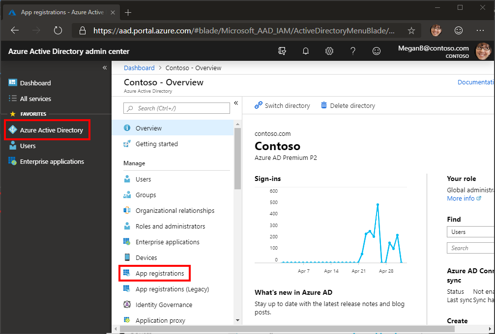

<!-- markdownlint-disable MD002 MD041 -->

この演習では、Azure Active Directory 管理センターを使用して、新しい Azure AD web アプリケーション登録を作成します。

1. ブラウザーを開き、[Azure Active Directory 管理センター](https://aad.portal.azure.com)へ移動します。 **個人用アカウント** (別名: Microsoft アカウント)、または**職場/学校アカウント**を使用してログインします。

1. 左側のナビゲーションで [ **Azure Active Directory** ] を選択し、[**管理**] の下にある [**アプリの登録**] を選択します。

    

1. **[新規登録]** を選択します。 **[アプリケーションを登録]** ページで、次のように値を設定します。

    - `React Graph Tutorial` に **[名前]** を設定します。
    - **[サポートされているアカウントの種類]** を **[任意の組織のディレクトリ内のアカウントと個人用の Microsoft アカウント]** に設定します。
    - **[リダイレクト URI]** で、最初のドロップダウン リストを `Web` に設定し、それから `http://localhost:3000` に値を設定します。

    ![[アプリケーションの登録] ページのスクリーンショット](./images/aad-register-an-app.png)

1. **[登録]** を選択します。 [グラフの対応]**チュートリアル**ページで、**アプリケーション (クライアント) ID**の値をコピーして保存します。次の手順で必要になります。

    

1. **[管理]** の下の **[認証]** を選択します。 暗黙的な**grant**セクションを見つけ、**アクセストークン**と**ID トークン**を有効にします。 **[保存]** を選択します。

    
